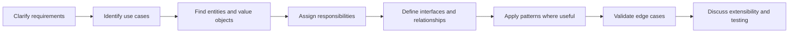

# Low-Level Design and Design Patterns — Java Interview Notes

A practical, interview-focused repository for mastering Low-Level Design (LLD), SOLID principles, UML, object modeling, and design patterns in Java.

## What this repository teaches

- How to convert requirements into classes and interfaces
- How to identify entities, behaviors, relationships, and invariants
- How to apply SOLID principles correctly
- How to select a design pattern instead of forcing one
- How to create extensible and testable Java designs
- How to explain trade-offs during an interview
- How to solve common LLD interview problems step by step

## Learning path

1. [LLD Fundamentals](docs/01-lld-fundamentals.md)
2. [Object-Oriented Analysis and UML](docs/02-object-modeling-uml.md)
3. [SOLID Principles](docs/03-solid-principles.md)
4. [Creational Patterns](docs/04-creational-patterns.md)
5. [Structural Patterns](docs/05-structural-patterns.md)
6. [Behavioral Patterns](docs/06-behavioral-patterns.md)
7. [Pattern Selection Guide](docs/07-pattern-selection.md)
8. [Parking Lot Design](docs/08-parking-lot.md)
9. [Splitwise Design](docs/09-splitwise.md)
10. [Elevator System Design](docs/10-elevator-system.md)
11. [BookMyShow Design](docs/11-bookmyshow.md)
12. [Machine Coding and Testing](docs/12-machine-coding.md)
13. [LLD Interview Questions](docs/13-interview-questions.md)
14. [Revision Plan](docs/14-revision-plan.md)

## Core interview workflow



## Key principle

> Good LLD is not about using the maximum number of patterns. It is about placing responsibilities in the right abstractions while keeping the design understandable, testable, and change-friendly.

## Repository structure

```text
lld-design-patterns-notes/
├── README.md
├── docs/
├── src/main/java/com/interview/lld/
└── src/test/java/com/interview/lld/
```

## Recommended GitHub topics

`java` `low-level-design` `lld` `design-patterns` `solid-principles` `object-oriented-design` `uml` `machine-coding` `java-interview`
