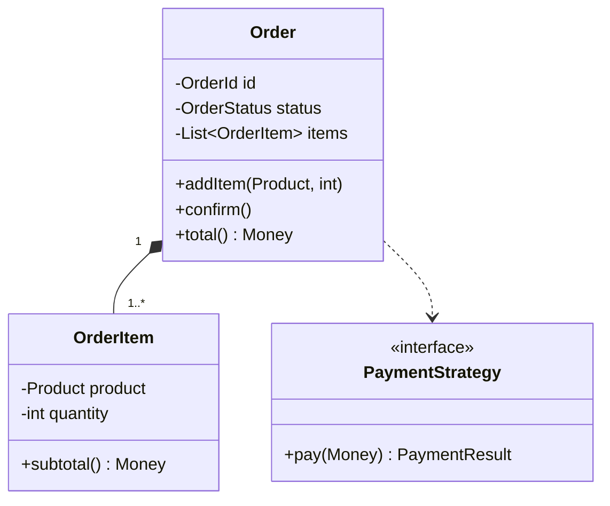
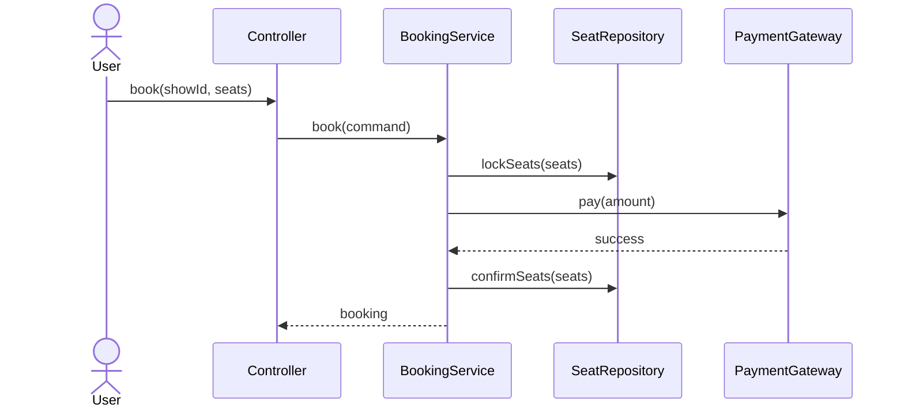
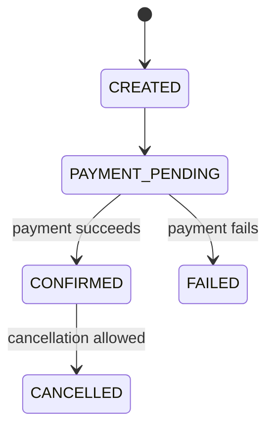

# 2. Object Modeling and UML

## Responsibility-driven design

Ask three questions for every class:

1. What does this class know?
2. What does this class do?
3. With whom does it collaborate?

A class should have one primary reason to change.

## Relationships

### Association

Objects know about each other.

```text
Order --> Customer
```

### Aggregation

A weak whole-part relationship. Parts can exist independently.

```text
Team o-- Player
```

### Composition

A strong ownership relationship. The part normally dies with the whole.

```text
Order *-- OrderItem
```

### Inheritance

Represents substitutability.

```text
Car --|> Vehicle
```

### Dependency

A temporary use, often through a method parameter.

```text
InvoiceService ..> TaxCalculator
```

## Class diagram example



## Sequence diagram

A sequence diagram explains runtime interaction.



## State modeling

State transitions should be explicit.



Avoid arbitrary setters such as `setStatus(CONFIRMED)`. Expose meaningful operations like `confirmPayment()`.

## Value objects

Use immutable value objects to model domain meaning.

```java
public record Money(java.math.BigDecimal amount, java.util.Currency currency) {
    public Money {
        if (amount.signum() < 0) {
            throw new IllegalArgumentException("Amount cannot be negative");
        }
    }
}
```

Benefits:

- Validation is centralized.
- Primitive obsession is reduced.
- Equality is value-based.
- APIs become expressive.
