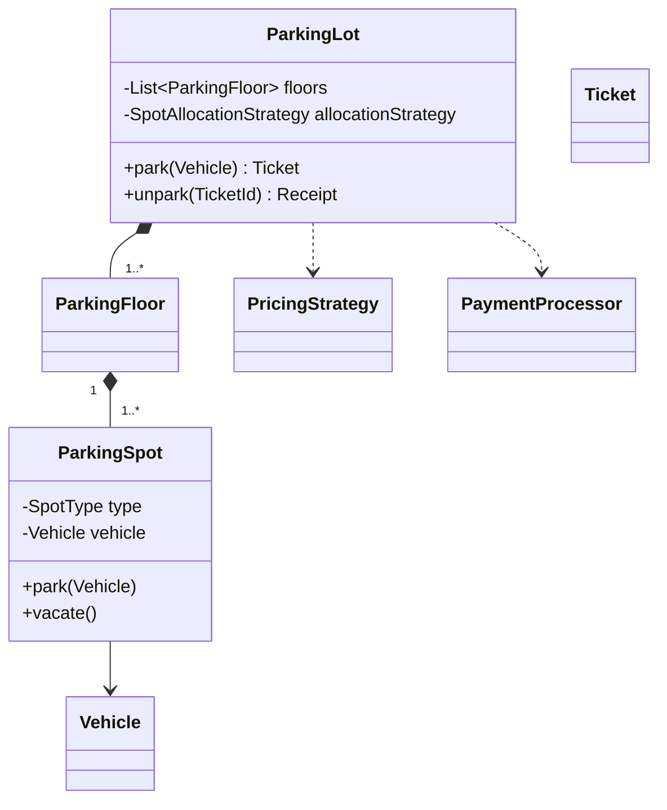

# 8. Parking Lot LLD

## Requirements

- Support motorcycle, car, and truck.
- Support multiple floors and entry/exit gates.
- Allocate a compatible available spot.
- Generate a ticket on entry.
- Calculate fees on exit.
- Process payment and release the spot.

## Core model



## Patterns

- Strategy: spot allocation and fee calculation.
- Factory: vehicle or spot creation when needed.
- Repository: ticket persistence.
- State: ticket lifecycle if transitions become complex.

## Concurrency

Two entry gates must not allocate the same spot.

Possible approaches:

- Database row locking
- Atomic compare-and-set on spot state
- Per-floor lock
- Distributed lock for multiple application instances

Locking the entire parking lot is simple but limits throughput. Fine-grained spot or floor locking scales better but is more complex.

## Important APIs

```java
Ticket park(Vehicle vehicle);
Receipt unpark(TicketId ticketId, PaymentMethod method);
List<SpotAvailability> availability();
```

## Interview extensions

- Reservation
- Electric charging spots
- Dynamic pricing
- Lost ticket handling
- Display boards
- Multiple payment providers
