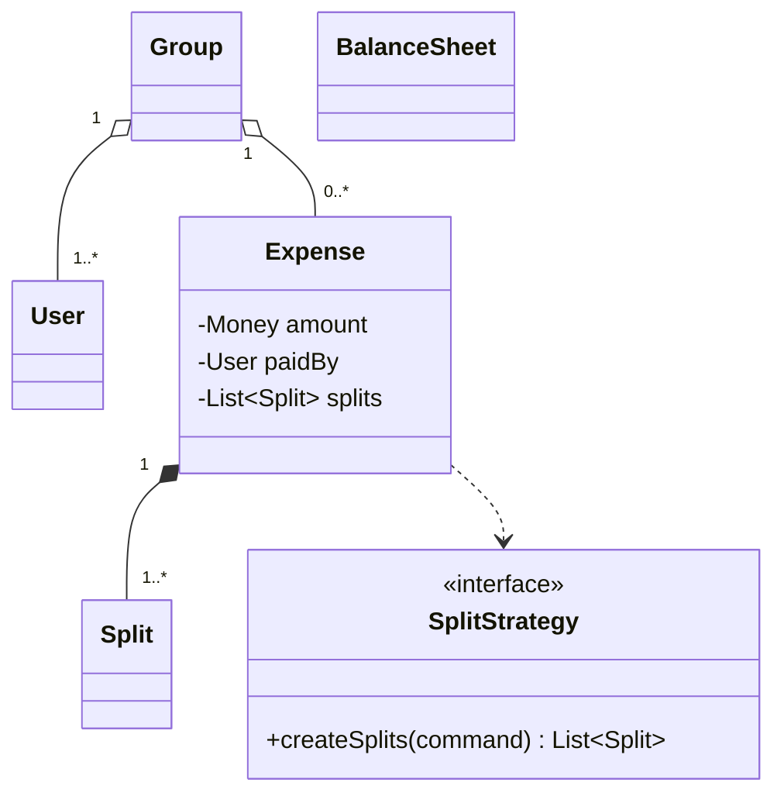

# 9. Splitwise LLD

## Requirements

- Create users and groups.
- Add expenses.
- Support equal, exact, and percentage splits.
- View balances.
- Settle payments.
- Simplify group debts.

## Model

## Strategy pattern

Implement:

- `EqualSplitStrategy`
- `ExactSplitStrategy`
- `PercentageSplitStrategy`

Every strategy validates that allocated values equal the total expense.

## Balance representation

Store net balances rather than every pairwise transaction where possible.

For user `A`:

- Positive balance: others owe A.
- Negative balance: A owes others.

Use `BigDecimal`, never `double`, for money.

## Debt simplification

A greedy simplification can repeatedly match the largest creditor with the largest debtor. It reduces transactions but may not always produce the mathematically minimum count under every constraint.

## Invariants

- Sum of splits equals expense amount.
- Percentages total 100.
- A user must belong to the group.
- Settlement cannot exceed the outstanding amount.
