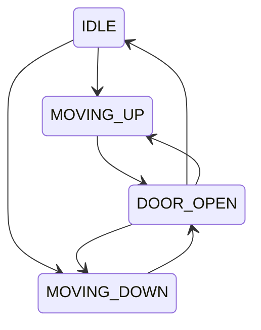

# 10. Elevator System LLD

## Requirements

- Multiple elevators serve multiple floors.
- Users submit external and internal requests.
- Scheduler assigns requests.
- Elevator moves, stops, and opens doors safely.

## Main classes

- `ElevatorSystem`
- `ElevatorController`
- `ElevatorCar`
- `ElevatorState`
- `Request`
- `SchedulingStrategy`
- `Door`
- `Display`

## State pattern

State objects prevent invalid operations such as opening doors while moving.

## Strategy pattern

Scheduling can vary:

- Nearest-car strategy
- Direction-aware strategy
- Zoning strategy
- Peak-hour strategy

## Data structures

An elevator can maintain:

- Min-heap for upward stops
- Max-heap for downward stops

This allows efficient ordered processing in both directions.

## Safety invariants

- Doors remain closed while moving.
- The car cannot move beyond valid floors.
- Emergency state overrides normal scheduling.
- Maximum load must not be exceeded.
