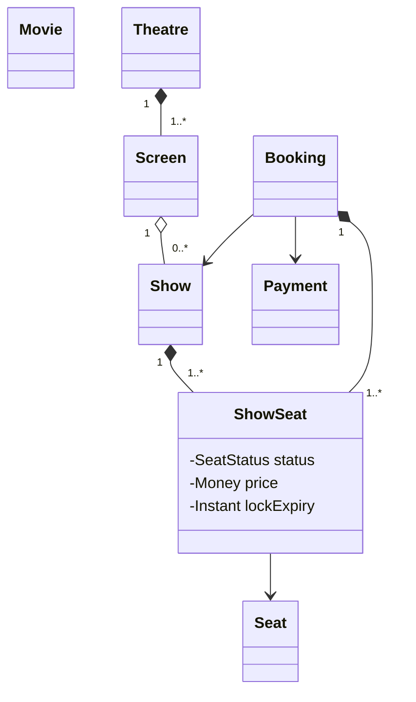
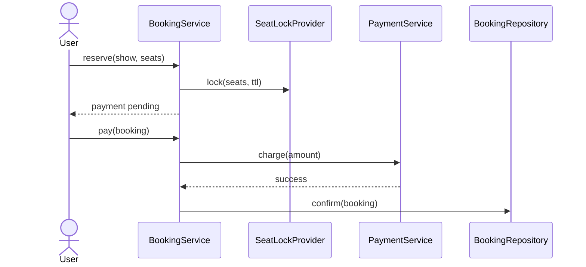

# 11. BookMyShow LLD

## Requirements

- Search movies and shows by city.
- View seat availability.
- Temporarily lock selected seats.
- Pay and confirm booking.
- Release locks after timeout or payment failure.

## Domain model

## Why `ShowSeat` is separate from `Seat`

A physical seat belongs to a screen, but price and availability vary by show. `ShowSeat` models show-specific state.

## Booking sequence

## Concurrency

The critical problem is double booking.

Possible safeguards:

- Unique database constraint on confirmed `show_id + seat_id`
- Optimistic locking with version field
- Redis lock with TTL for temporary holds
- Database transaction during confirmation

A Redis lock alone is not the final source of truth. The database must enforce uniqueness.

## Patterns

- Strategy: pricing and payment provider.
- State: booking lifecycle.
- Adapter: external payment gateway.
- Observer: confirmation notifications.
