# SOLID Principles in Java — In-Depth Guide

A complete guide to SOLID principles in Java with clear explanations, UML-style diagrams, bad and good examples, Spring Boot relevance, design trade-offs, practical use cases, and interview questions.

---

## Table of Contents

1. [What is SOLID?](#1-what-is-solid)
2. [Why SOLID Matters](#2-why-solid-matters)
3. [Overview of the Five Principles](#3-overview-of-the-five-principles)
4. [Single Responsibility Principle](#4-single-responsibility-principle)
5. [Open-Closed Principle](#5-open-closed-principle)
6. [Liskov Substitution Principle](#6-liskov-substitution-principle)
7. [Interface Segregation Principle](#7-interface-segregation-principle)
8. [Dependency Inversion Principle](#8-dependency-inversion-principle)
9. [Complete SOLID Example](#9-complete-solid-example)
10. [SOLID in Spring Boot](#10-solid-in-spring-boot)
11. [SOLID vs Design Patterns](#11-solid-vs-design-patterns)
12. [Common Mistakes](#12-common-mistakes)
13. [Best Practices](#13-best-practices)
14. [Interview Questions and Answers](#14-interview-questions-and-answers)
15. [Summary](#15-summary)

---

# 1. What is SOLID?

SOLID is an acronym representing five object-oriented design principles:

- **S** — Single Responsibility Principle
- **O** — Open-Closed Principle
- **L** — Liskov Substitution Principle
- **I** — Interface Segregation Principle
- **D** — Dependency Inversion Principle

These principles help developers write software that is:

- Maintainable
- Extensible
- Testable
- Reusable
- Loosely coupled
- Easier to understand

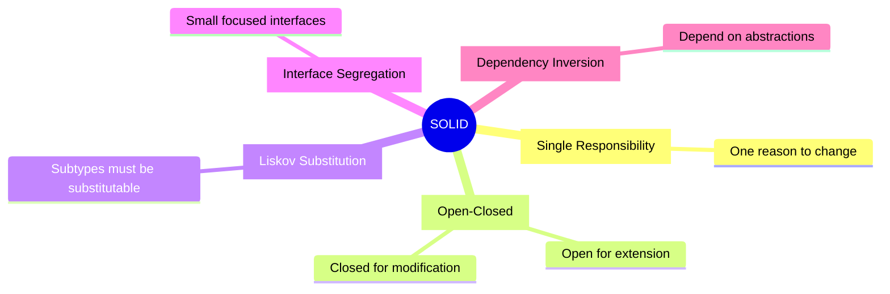

---

# 2. Why SOLID Matters

Without good design principles, software often becomes:

- Hard to modify
- Hard to test
- Tightly coupled
- Fragile
- Full of duplicated logic
- Difficult to extend
- Risky to deploy

## Poorly designed system

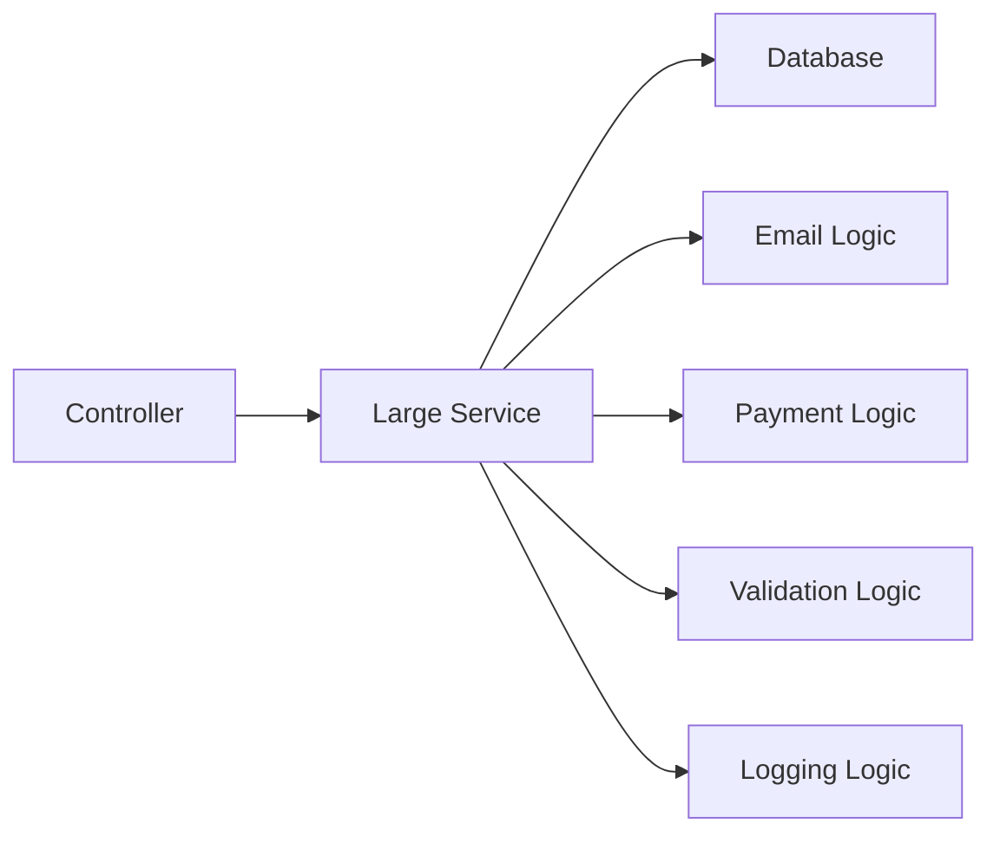

One class is responsible for too many things.

A small change in one area may impact many unrelated areas.

## Better design

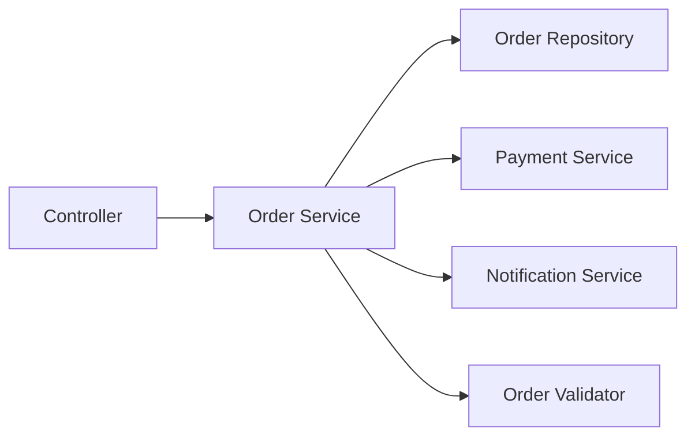

Each component has a focused responsibility.

---

# 3. Overview of the Five Principles

| Principle | Main Idea |
|---|---|
| SRP | A class should have one reason to change |
| OCP | Software should be open for extension and closed for modification |
| LSP | A subclass should safely replace its parent |
| ISP | Clients should not depend on methods they do not use |
| DIP | High-level modules should depend on abstractions |

---

# 4. Single Responsibility Principle

## Definition

A class should have only one reason to change.

This does not mean that a class must have only one method.

It means that all methods in a class should contribute to one responsibility.

## Bad example

```java
public class InvoiceService {

    public double calculateTotal(Invoice invoice) {
        return invoice.items()
                .stream()
                .mapToDouble(InvoiceItem::totalPrice)
                .sum();
    }

    public void saveToDatabase(Invoice invoice) {
        System.out.println(
                "Saving invoice to database"
        );
    }

    public void sendEmail(Invoice invoice) {
        System.out.println(
                "Sending invoice by email"
        );
    }

    public void generatePdf(Invoice invoice) {
        System.out.println(
                "Generating invoice PDF"
        );
    }
}
```

## Problems

This class changes when:

- Invoice calculation rules change
- Database logic changes
- Email provider changes
- PDF format changes

That means it has multiple reasons to change.

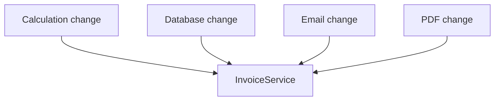

## Better design

### InvoiceCalculator

```java
public class InvoiceCalculator {

    public double calculateTotal(
            Invoice invoice
    ) {
        return invoice.items()
                .stream()
                .mapToDouble(
                        InvoiceItem::totalPrice
                )
                .sum();
    }
}
```

### InvoiceRepository

```java
public class InvoiceRepository {

    public void save(Invoice invoice) {
        System.out.println(
                "Saving invoice to database"
        );
    }
}
```

### InvoiceEmailService

```java
public class InvoiceEmailService {

    public void send(Invoice invoice) {
        System.out.println(
                "Sending invoice by email"
        );
    }
}
```

### InvoicePdfGenerator

```java
public class InvoicePdfGenerator {

    public void generate(Invoice invoice) {
        System.out.println(
                "Generating invoice PDF"
        );
    }
}
```

## Improved design

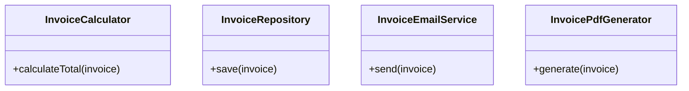

Each class has one clear responsibility.

## Real-world interpretation

SRP can be applied at many levels:

- Method
- Class
- Package
- Module
- Microservice

## Common SRP violation signs

- Class name contains words like `Manager`, `Helper`, or `Util`
- Class has many unrelated dependencies
- Class contains database, email, and validation logic together
- Class changes for unrelated business requirements
- Unit tests require too many mocks

---

# 5. Open-Closed Principle

## Definition

Software entities should be:

- Open for extension
- Closed for modification

You should be able to add new behavior without changing stable existing code.

## Bad example

```java
public class DiscountCalculator {

    public double calculateDiscount(
            String customerType,
            double amount
    ) {
        if ("REGULAR".equals(customerType)) {
            return amount * 0.05;
        }

        if ("PREMIUM".equals(customerType)) {
            return amount * 0.10;
        }

        if ("VIP".equals(customerType)) {
            return amount * 0.20;
        }

        return 0;
    }
}
```

## Problem

Every new customer type requires modifying this class.

This creates:

- Repeated conditional logic
- Regression risk
- Violations of OCP
- Growing complexity


## Better design using Strategy

### DiscountPolicy

```java
public interface DiscountPolicy {

    double calculateDiscount(double amount);
}
```

### RegularDiscountPolicy

```java
public class RegularDiscountPolicy
        implements DiscountPolicy {

    @Override
    public double calculateDiscount(
            double amount
    ) {
        return amount * 0.05;
    }
}
```

### PremiumDiscountPolicy

```java
public class PremiumDiscountPolicy
        implements DiscountPolicy {

    @Override
    public double calculateDiscount(
            double amount
    ) {
        return amount * 0.10;
    }
}
```

### VipDiscountPolicy

```java
public class VipDiscountPolicy
        implements DiscountPolicy {

    @Override
    public double calculateDiscount(
            double amount
    ) {
        return amount * 0.20;
    }
}
```

### DiscountService

```java
public class DiscountService {

    public double applyDiscount(
            double amount,
            DiscountPolicy policy
    ) {
        double discount =
                policy.calculateDiscount(amount);

        return amount - discount;
    }
}
```

## Usage

```java
public class Main {

    public static void main(String[] args) {
        DiscountService service =
                new DiscountService();

        DiscountPolicy policy =
                new PremiumDiscountPolicy();

        double finalAmount =
                service.applyDiscount(
                        1000,
                        policy
                );

        System.out.println(finalAmount);
    }
}
```

## OCP diagram

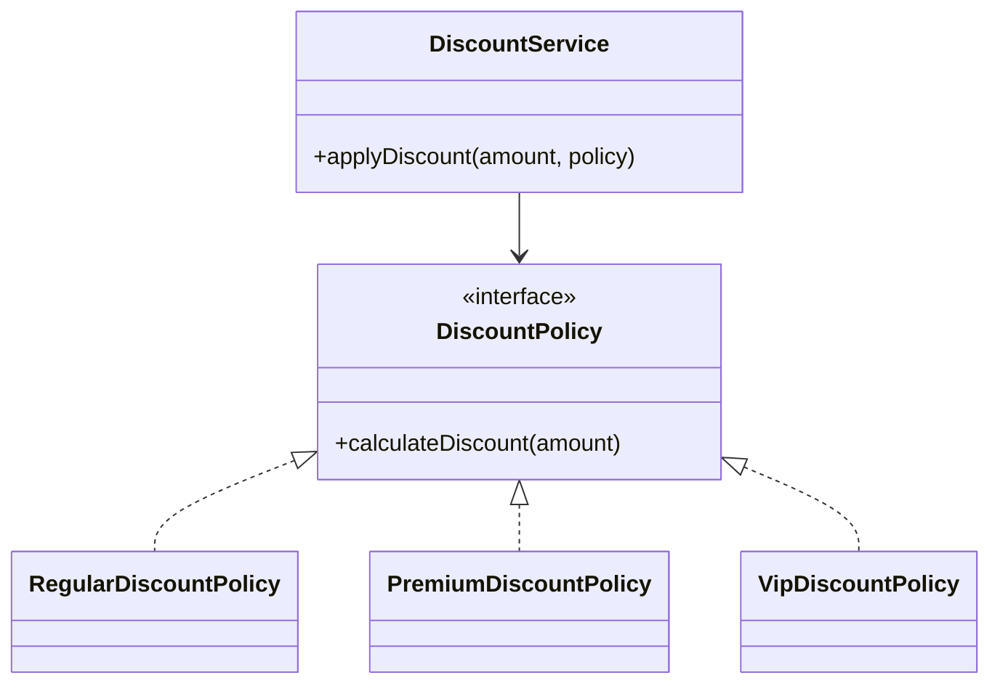

New discount policies can be added without modifying `DiscountService`.

## OCP techniques

Common techniques:

- Interfaces
- Abstract classes
- Strategy pattern
- Factory pattern
- Template method
- Decorator pattern
- Plugin architecture

## Important clarification

OCP does not mean code should never be modified.

It means stable core behavior should not need modification for every new variation.

---

# 6. Liskov Substitution Principle

## Definition

Objects of a superclass should be replaceable with objects of a subclass without breaking correctness.

In simple terms:

```text
If B is a subtype of A,
then B should be usable wherever A is expected.
```

## Bad example

```java
public class Bird {

    public void fly() {
        System.out.println(
                "Bird is flying"
        );
    }
}
```

```java
public class Penguin extends Bird {

    @Override
    public void fly() {
        throw new UnsupportedOperationException(
                "Penguins cannot fly"
        );
    }
}
```

## Problem

Code that expects every `Bird` to fly breaks when it receives a `Penguin`.

```java
public class BirdService {

    public void makeBirdFly(Bird bird) {
        bird.fly();
    }
}
```

```java
BirdService service =
        new BirdService();

service.makeBirdFly(
        new Penguin()
);
```

This violates LSP.

## Better design

### Bird

```java
public interface Bird {

    void eat();
}
```

### FlyingBird

```java
public interface FlyingBird
        extends Bird {

    void fly();
}
```

### Sparrow

```java
public class Sparrow
        implements FlyingBird {

    @Override
    public void eat() {
        System.out.println(
                "Sparrow is eating"
        );
    }

    @Override
    public void fly() {
        System.out.println(
                "Sparrow is flying"
        );
    }
}
```

### Penguin

```java
public class Penguin
        implements Bird {

    @Override
    public void eat() {
        System.out.println(
                "Penguin is eating"
        );
    }
}
```

## Diagram

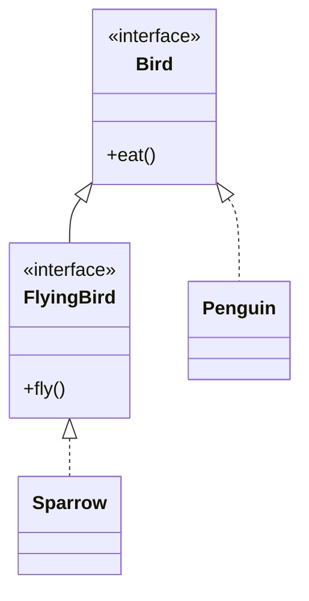

## LSP rules

A subtype should not:

- Strengthen preconditions
- Weaken postconditions
- Break expected behavior
- Throw unexpected exceptions
- Return incompatible results
- Violate invariants

## Rectangle-Square example

### Problematic design

```java
public class Rectangle {

    protected int width;
    protected int height;

    public void setWidth(int width) {
        this.width = width;
    }

    public void setHeight(int height) {
        this.height = height;
    }

    public int area() {
        return width * height;
    }
}
```

```java
public class Square extends Rectangle {

    @Override
    public void setWidth(int width) {
        this.width = width;
        this.height = width;
    }

    @Override
    public void setHeight(int height) {
        this.width = height;
        this.height = height;
    }
}
```

Client code:

```java
public static void resize(
        Rectangle rectangle
) {
    rectangle.setWidth(5);
    rectangle.setHeight(10);

    System.out.println(
            rectangle.area()
    );
}
```

Expected for rectangle:

```text
50
```

But square returns:

```text
100
```

The subtype changes expected behavior.

## Better design

```java
public interface Shape {

    int area();
}
```

```java
public record Rectangle(
        int width,
        int height
) implements Shape {

    @Override
    public int area() {
        return width * height;
    }
}
```

```java
public record Square(
        int side
) implements Shape {

    @Override
    public int area() {
        return side * side;
    }
}
```

---

# 7. Interface Segregation Principle

## Definition

Clients should not be forced to depend on methods they do not use.

Prefer small and focused interfaces over large general-purpose interfaces.

## Bad example

```java
public interface Worker {

    void work();

    void eat();

    void sleep();

    void attendMeeting();
}
```

### HumanWorker

```java
public class HumanWorker
        implements Worker {

    @Override
    public void work() {
        System.out.println(
                "Human is working"
        );
    }

    @Override
    public void eat() {
        System.out.println(
                "Human is eating"
        );
    }

    @Override
    public void sleep() {
        System.out.println(
                "Human is sleeping"
        );
    }

    @Override
    public void attendMeeting() {
        System.out.println(
                "Human is attending meeting"
        );
    }
}
```

### RobotWorker

```java
public class RobotWorker
        implements Worker {

    @Override
    public void work() {
        System.out.println(
                "Robot is working"
        );
    }

    @Override
    public void eat() {
        throw new UnsupportedOperationException();
    }

    @Override
    public void sleep() {
        throw new UnsupportedOperationException();
    }

    @Override
    public void attendMeeting() {
        throw new UnsupportedOperationException();
    }
}
```

The robot is forced to implement irrelevant methods.

## Better design

### Workable

```java
public interface Workable {

    void work();
}
```

### Eatable

```java
public interface Eatable {

    void eat();
}
```

### Sleepable

```java
public interface Sleepable {

    void sleep();
}
```

### MeetingParticipant

```java
public interface MeetingParticipant {

    void attendMeeting();
}
```

### HumanWorker

```java
public class HumanWorker
        implements Workable,
        Eatable,
        Sleepable,
        MeetingParticipant {

    @Override
    public void work() {
        System.out.println(
                "Human is working"
        );
    }

    @Override
    public void eat() {
        System.out.println(
                "Human is eating"
        );
    }

    @Override
    public void sleep() {
        System.out.println(
                "Human is sleeping"
        );
    }

    @Override
    public void attendMeeting() {
        System.out.println(
                "Human is attending meeting"
        );
    }
}
```

### RobotWorker

```java
public class RobotWorker
        implements Workable {

    @Override
    public void work() {
        System.out.println(
                "Robot is working"
        );
    }
}
```

## Diagram

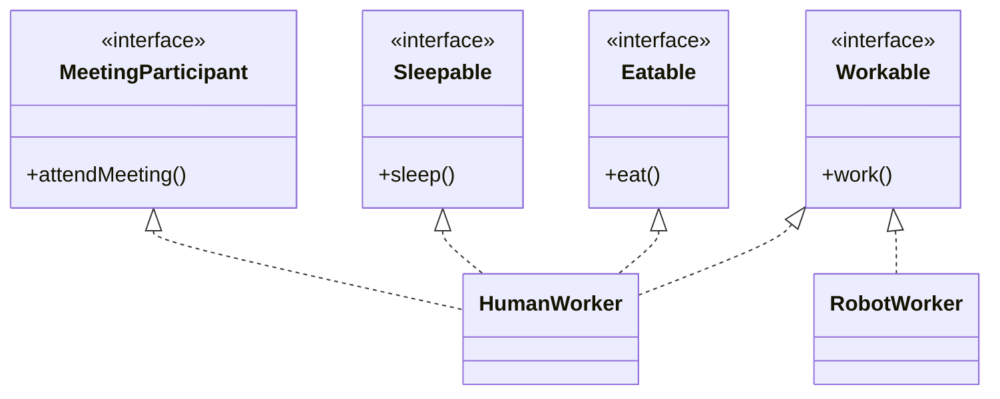

## Benefits

- Lower coupling
- Easier testing
- Better reusability
- Fewer unsupported operations
- Cleaner contracts
- Easier implementation

## ISP in API design

Bad interface:

```java
public interface UserService {

    User createUser(User user);

    User updateUser(User user);

    void deleteUser(long id);

    User findById(long id);

    List<User> findAll();

    void exportUsers();

    void importUsers();
}
```

Better split:

```java
public interface UserCommandService {

    User createUser(User user);

    User updateUser(User user);

    void deleteUser(long id);
}
```

```java
public interface UserQueryService {

    User findById(long id);

    List<User> findAll();
}
```

```java
public interface UserImportExportService {

    void exportUsers();

    void importUsers();
}
```

---

# 8. Dependency Inversion Principle

## Definition

High-level modules should not depend on low-level modules.

Both should depend on abstractions.

Also:

- Abstractions should not depend on details
- Details should depend on abstractions

## Bad example

```java
public class EmailNotificationSender {

    public void send(
            String recipient,
            String message
    ) {
        System.out.println(
                "Sending email to "
                        + recipient
                        + ": "
                        + message
        );
    }
}
```

```java
public class OrderService {

    private final EmailNotificationSender sender =
            new EmailNotificationSender();

    public void placeOrder(
            String customerEmail
    ) {
        System.out.println(
                "Order placed"
        );

        sender.send(
                customerEmail,
                "Your order has been placed"
        );
    }
}
```

## Problems

`OrderService` is tightly coupled to email.

To support SMS, push, or WhatsApp:

- `OrderService` must be modified
- Testing becomes harder
- Low-level details leak into high-level logic

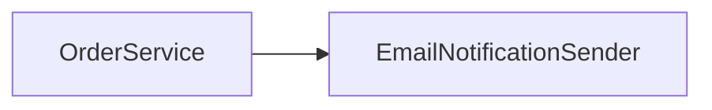

## Better design

### NotificationSender

```java
public interface NotificationSender {

    void send(
            String recipient,
            String message
    );
}
```

### EmailNotificationSender

```java
public class EmailNotificationSender
        implements NotificationSender {

    @Override
    public void send(
            String recipient,
            String message
    ) {
        System.out.println(
                "Sending email to "
                        + recipient
                        + ": "
                        + message
        );
    }
}
```

### SmsNotificationSender

```java
public class SmsNotificationSender
        implements NotificationSender {

    @Override
    public void send(
            String recipient,
            String message
    ) {
        System.out.println(
                "Sending SMS to "
                        + recipient
                        + ": "
                        + message
        );
    }
}
```

### OrderService

```java
public class OrderService {

    private final NotificationSender sender;

    public OrderService(
            NotificationSender sender
    ) {
        this.sender = sender;
    }

    public void placeOrder(
            String recipient
    ) {
        System.out.println(
                "Order placed"
        );

        sender.send(
                recipient,
                "Your order has been placed"
        );
    }
}
```

## Usage

```java
public class Main {

    public static void main(String[] args) {
        NotificationSender sender =
                new EmailNotificationSender();

        OrderService service =
                new OrderService(sender);

        service.placeOrder(
                "user@example.com"
        );
    }
}
```

## Diagram

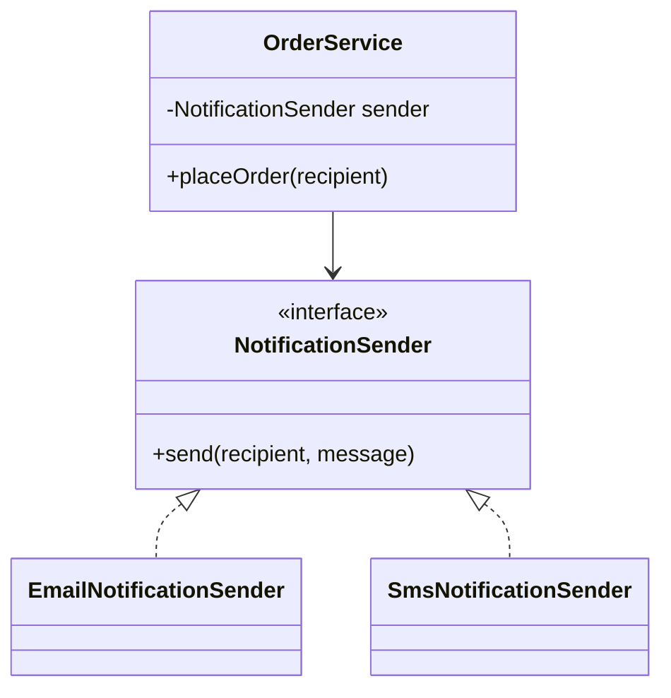

## Constructor injection

Constructor injection is generally preferred because:

- Dependencies are explicit
- Object cannot exist in invalid state
- Easier testing
- Supports immutability
- Avoids hidden dependencies

## Unit test example

```java
public class FakeNotificationSender
        implements NotificationSender {

    private String lastMessage;

    @Override
    public void send(
            String recipient,
            String message
    ) {
        this.lastMessage = message;
    }

    public String getLastMessage() {
        return lastMessage;
    }
}
```

```java
public class OrderServiceTest {

    public static void main(String[] args) {
        FakeNotificationSender sender =
                new FakeNotificationSender();

        OrderService service =
                new OrderService(sender);

        service.placeOrder(
                "test@example.com"
        );

        System.out.println(
                sender.getLastMessage()
        );
    }
}
```

---

# 9. Complete SOLID Example

We will design a payment-processing system.

## Requirements

- Support multiple payment methods
- Validate payment requests
- Store payment records
- Send notifications
- Allow future payment methods
- Keep components testable

## Domain model

```java
public record PaymentRequest(
        String orderId,
        String customerId,
        double amount
) {
}
```

```java
public record PaymentResult(
        boolean successful,
        String transactionId,
        String message
) {
}
```

## PaymentProcessor

```java
public interface PaymentProcessor {

    PaymentResult process(
            PaymentRequest request
    );
}
```

## CardPaymentProcessor

```java
import java.util.UUID;

public class CardPaymentProcessor
        implements PaymentProcessor {

    @Override
    public PaymentResult process(
            PaymentRequest request
    ) {
        return new PaymentResult(
                true,
                UUID.randomUUID().toString(),
                "Card payment successful"
        );
    }
}
```

## UpiPaymentProcessor

```java
import java.util.UUID;

public class UpiPaymentProcessor
        implements PaymentProcessor {

    @Override
    public PaymentResult process(
            PaymentRequest request
    ) {
        return new PaymentResult(
                true,
                UUID.randomUUID().toString(),
                "UPI payment successful"
        );
    }
}
```

## PaymentValidator

```java
public class PaymentValidator {

    public void validate(
            PaymentRequest request
    ) {
        if (request == null) {
            throw new IllegalArgumentException(
                    "Payment request is required"
            );
        }

        if (request.amount() <= 0) {
            throw new IllegalArgumentException(
                    "Amount must be positive"
            );
        }

        if (request.orderId() == null
                || request.orderId().isBlank()) {
            throw new IllegalArgumentException(
                    "Order ID is required"
            );
        }
    }
}
```

## PaymentRepository

```java
public interface PaymentRepository {

    void save(
            PaymentRequest request,
            PaymentResult result
    );
}
```

## InMemoryPaymentRepository

```java
import java.util.ArrayList;
import java.util.List;

public class InMemoryPaymentRepository
        implements PaymentRepository {

    private final List<String> records =
            new ArrayList<>();

    @Override
    public void save(
            PaymentRequest request,
            PaymentResult result
    ) {
        records.add(
                request.orderId()
                        + " -> "
                        + result.transactionId()
        );
    }

    public List<String> getRecords() {
        return List.copyOf(records);
    }
}
```

## NotificationSender

```java
public interface NotificationSender {

    void send(
            String customerId,
            String message
    );
}
```

## ConsoleNotificationSender

```java
public class ConsoleNotificationSender
        implements NotificationSender {

    @Override
    public void send(
            String customerId,
            String message
    ) {
        System.out.println(
                "Notification to "
                        + customerId
                        + ": "
                        + message
        );
    }
}
```

## PaymentService

```java
public class PaymentService {

    private final PaymentProcessor processor;
    private final PaymentValidator validator;
    private final PaymentRepository repository;
    private final NotificationSender notificationSender;

    public PaymentService(
            PaymentProcessor processor,
            PaymentValidator validator,
            PaymentRepository repository,
            NotificationSender notificationSender
    ) {
        this.processor = processor;
        this.validator = validator;
        this.repository = repository;
        this.notificationSender =
                notificationSender;
    }

    public PaymentResult processPayment(
            PaymentRequest request
    ) {
        validator.validate(request);

        PaymentResult result =
                processor.process(request);

        repository.save(
                request,
                result
        );

        notificationSender.send(
                request.customerId(),
                result.message()
        );

        return result;
    }
}
```

## Main

```java
public class Main {

    public static void main(String[] args) {
        PaymentProcessor processor =
                new UpiPaymentProcessor();

        PaymentValidator validator =
                new PaymentValidator();

        PaymentRepository repository =
                new InMemoryPaymentRepository();

        NotificationSender sender =
                new ConsoleNotificationSender();

        PaymentService service =
                new PaymentService(
                        processor,
                        validator,
                        repository,
                        sender
                );

        PaymentRequest request =
                new PaymentRequest(
                        "ORDER-101",
                        "CUSTOMER-501",
                        2499
                );

        PaymentResult result =
                service.processPayment(request);

        System.out.println(result);
    }
}
```

## Complete class diagram

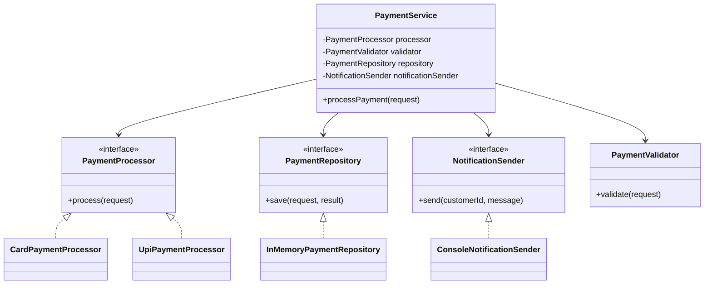

## SOLID mapping

| Principle | Usage |
|---|---|
| SRP | Validator, repository, processor, and notifier have separate responsibilities |
| OCP | New payment processors can be added without changing PaymentService |
| LSP | Any PaymentProcessor implementation can replace another |
| ISP | Interfaces are small and focused |
| DIP | PaymentService depends on abstractions |

---

# 10. SOLID in Spring Boot

Spring Boot naturally supports SOLID through:

- Dependency injection
- Interface-based services
- Layered architecture
- Component scanning
- Constructor injection
- Profiles and configurations

## Example

### PaymentProcessor

```java
public interface PaymentProcessor {

    PaymentResult process(
            PaymentRequest request
    );
}
```

### UPI implementation

```java
@Component
public class UpiPaymentProcessor
        implements PaymentProcessor {

    @Override
    public PaymentResult process(
            PaymentRequest request
    ) {
        return new PaymentResult(
                true,
                "TXN-101",
                "UPI payment successful"
        );
    }
}
```

### Service

```java
@Service
public class PaymentService {

    private final PaymentProcessor processor;

    public PaymentService(
            PaymentProcessor processor
    ) {
        this.processor = processor;
    }

    public PaymentResult process(
            PaymentRequest request
    ) {
        return processor.process(request);
    }
}
```

## Multiple implementations

Use:

- `@Qualifier`
- `@Primary`
- Strategy map
- Factory pattern

### Strategy map example

```java
@Service
public class PaymentProcessorFactory {

    private final Map<String, PaymentProcessor>
            processors;

    public PaymentProcessorFactory(
            List<PaymentProcessor> processorList
    ) {
        this.processors =
                processorList.stream()
                        .collect(
                                Collectors.toMap(
                                        processor ->
                                                processor
                                                        .getClass()
                                                        .getSimpleName(),
                                        processor ->
                                                processor
                                )
                        );
    }

    public PaymentProcessor get(
            String type
    ) {
        PaymentProcessor processor =
                processors.get(type);

        if (processor == null) {
            throw new IllegalArgumentException(
                    "Unsupported payment type: "
                            + type
            );
        }

        return processor;
    }
}
```

---

# 11. SOLID vs Design Patterns

SOLID principles are guidelines.

Design patterns are reusable solutions.

## Relationship

| SOLID Principle | Common Supporting Patterns |
|---|---|
| SRP | Facade, Command, Repository |
| OCP | Strategy, Factory, Decorator |
| LSP | Proper inheritance, composition |
| ISP | Adapter, Role interfaces |
| DIP | Dependency Injection, Factory |

## Example

Strategy pattern supports OCP and DIP.

Factory pattern supports OCP and DIP.

Decorator supports OCP.

Repository supports SRP and DIP.

---

# 12. Common Mistakes

## 1. Creating interfaces for every class

Not every class needs an interface.

Create abstractions when:

- Multiple implementations exist
- Substitution is useful
- Testing benefits
- External boundaries exist

## 2. Overengineering

Too many layers and interfaces can increase complexity.

## 3. Confusing SRP with one method per class

SRP is about one reason to change.

## 4. Using inheritance only for code reuse

Prefer composition when the relationship is not truly IS-A.

## 5. Treating SOLID as absolute rules

SOLID principles are guidelines.

Practical trade-offs matter.

## 6. Using giant service interfaces

Large interfaces violate ISP.

## 7. Depending directly on frameworks

Core business logic should avoid unnecessary framework coupling.

## 8. Adding abstractions without variation

Abstractions should solve a real design problem.

---

# 13. Best Practices

## 1. Start simple

Do not create unnecessary abstractions too early.

## 2. Refactor when variation appears

Add interfaces when multiple implementations become meaningful.

## 3. Prefer constructor injection

Dependencies remain explicit and testable.

## 4. Prefer composition over inheritance

Composition is often more flexible.

## 5. Keep interfaces focused

One interface should represent one coherent capability.

## 6. Isolate external systems

Use abstractions around:

- Database
- Message broker
- Payment gateway
- Email service
- External APIs

## 7. Write tests around abstractions

Mock or fake interfaces at boundaries.

## 8. Avoid large conditional blocks

Use strategies or polymorphism when behavior varies.

## 9. Do not expose low-level details to high-level modules

Translate infrastructure details into domain abstractions.

## 10. Review responsibilities regularly

Classes often grow over time and begin violating SRP.

---

# 14. Interview Questions and Answers

## 1. What is SOLID?

SOLID is a set of five object-oriented design principles that improve maintainability, extensibility, and testability.

---

## 2. What does S stand for?

Single Responsibility Principle.

---

## 3. What does SRP mean?

A class should have one reason to change.

---

## 4. Does SRP mean one method per class?

No. It means one cohesive responsibility.

---

## 5. What is a common SRP violation?

A service class that handles validation, persistence, notification, and formatting.

---

## 6. What does O stand for?

Open-Closed Principle.

---

## 7. What does OCP mean?

Software should be open for extension and closed for modification.

---

## 8. How can OCP be achieved?

Using interfaces, abstraction, polymorphism, and design patterns such as Strategy.

---

## 9. Give an OCP violation example.

A large `if-else` block that must be modified for every new payment type.

---

## 10. What does L stand for?

Liskov Substitution Principle.

---

## 11. What does LSP mean?

A subtype must be safely substitutable for its base type.

---

## 12. What is a common LSP violation?

A subclass overriding a method only to throw `UnsupportedOperationException`.

---

## 13. Why does Penguin extending FlyingBird violate LSP?

Because Penguin cannot satisfy the behavior expected from FlyingBird.

---

## 14. What does I stand for?

Interface Segregation Principle.

---

## 15. What does ISP mean?

Clients should not depend on methods they do not use.

---

## 16. What is a fat interface?

A large interface containing unrelated methods.

---

## 17. How do you fix a fat interface?

Split it into smaller role-based interfaces.

---

## 18. What does D stand for?

Dependency Inversion Principle.

---

## 19. What does DIP mean?

High-level and low-level modules should depend on abstractions.

---

## 20. Is dependency injection the same as DIP?

No. Dependency injection is a technique that helps implement DIP.

---

## 21. What is inversion of control?

Control over object creation and dependency management is transferred to a container or framework.

---

## 22. Why is constructor injection preferred?

It makes dependencies explicit, supports immutability, and simplifies testing.

---

## 23. How does Spring support DIP?

Through dependency injection and interface-based bean wiring.

---

## 24. What is the difference between DIP and DI?

DIP is a design principle.

DI is an implementation technique.

---

## 25. How does Strategy pattern support SOLID?

It supports OCP and DIP by allowing behavior to vary through abstractions.

---

## 26. How does Repository pattern support SOLID?

It separates persistence logic and lets services depend on repository abstractions.

---

## 27. How does Factory pattern support SOLID?

It isolates object creation and supports OCP and DIP.

---

## 28. Is SOLID only for object-oriented programming?

It originated in OOP, but many ideas apply broadly to modular software design.

---

## 29. Can too much SOLID be harmful?

Yes. Excessive abstraction can create unnecessary complexity.

---

## 30. When should an interface be introduced?

When multiple implementations, substitution, testing, or boundary isolation are useful.

---

## 31. What is high cohesion?

A class has closely related responsibilities.

---

## 32. What is low coupling?

Components have minimal dependency on each other's implementation details.

---

## 33. How are cohesion and SRP related?

SRP encourages highly cohesive classes.

---

## 34. How are coupling and DIP related?

DIP reduces coupling by making modules depend on abstractions.

---

## 35. Why prefer composition over inheritance?

Composition is more flexible and avoids fragile inheritance hierarchies.

---

## 36. What is the Rectangle-Square problem?

It demonstrates an LSP violation because Square cannot always behave like a mutable Rectangle.

---

## 37. How do you identify SRP violations in code reviews?

Look for classes with unrelated methods, many dependencies, or multiple reasons to change.

---

## 38. How do you identify OCP violations?

Look for repeated conditionals that grow whenever a new type or behavior is added.

---

## 39. How do you identify ISP violations?

Look for implementations with empty methods or unsupported-operation exceptions.

---

## 40. How do you identify DIP violations?

Look for high-level services directly creating low-level dependencies with `new`.

---

## 41. What is a stable abstraction?

An abstraction that represents a meaningful contract unlikely to change frequently.

---

## 42. Can an abstract class support OCP?

Yes. New subclasses can extend behavior without modifying existing code.

---

## 43. Is every use of if-else an OCP violation?

No. Conditionals are acceptable when behavior is simple and unlikely to vary.

---

## 44. Can records be used in SOLID design?

Yes. Records are useful for immutable data carriers and domain values.

---

## 45. How does SOLID improve testability?

Small focused classes and injected abstractions are easier to isolate and test.

---

## 46. What is a dependency boundary?

A point where business logic interacts with an external system or implementation detail.

---

## 47. Why should domain logic avoid framework dependencies?

It keeps the core logic reusable, testable, and independent.

---

## 48. How does microservice architecture relate to SRP?

Each microservice should ideally own one bounded business capability.

---

## 49. Can SOLID principles conflict?

Sometimes. Design requires balancing simplicity, abstraction, and maintainability.

---

## 50. What is the most important SOLID principle?

There is no single most important principle. SRP and DIP are often the most visible in day-to-day architecture.

---

# 15. Summary

SOLID principles improve object-oriented design by encouraging focused responsibilities, extensibility, substitutability, small interfaces, and abstraction-driven dependencies.

## Quick reference

| Principle | Key Question |
|---|---|
| SRP | Does this class have more than one reason to change? |
| OCP | Can new behavior be added without modifying stable code? |
| LSP | Can every subtype safely replace the parent type? |
| ISP | Are clients forced to depend on unused methods? |
| DIP | Does high-level logic depend on abstractions? |

## Final design mindset

- Keep classes focused
- Prefer extension over repeated modification
- Use inheritance only when substitution is valid
- Keep interfaces small
- Depend on abstractions
- Use constructor injection
- Avoid overengineering
- Refactor based on real change patterns

---

## Recommended Practice Problems

1. Refactor a large order service using SRP.
2. Replace payment `if-else` logic with Strategy.
3. Fix a Bird-Penguin LSP violation.
4. Split a large worker interface.
5. Refactor direct email dependency using DIP.
6. Build a notification system with multiple channels.
7. Design a discount engine following SOLID.
8. Create a payment system with repository and processor abstractions.
9. Write unit tests using fake implementations.
10. Review a Spring Boot service for SOLID violations.
